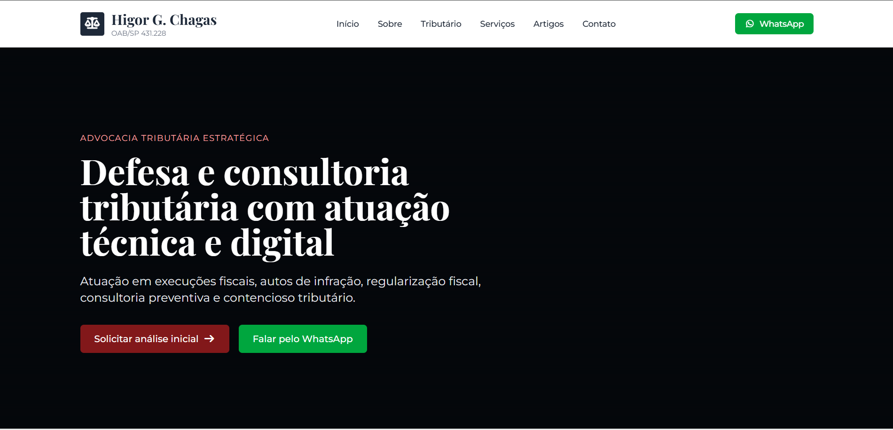
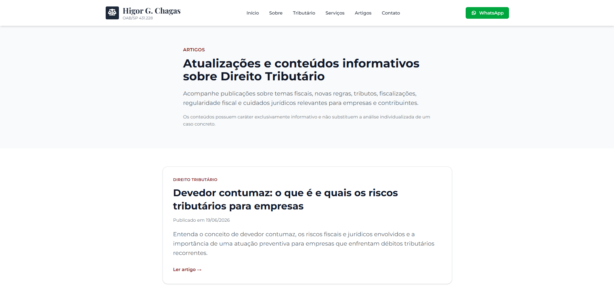
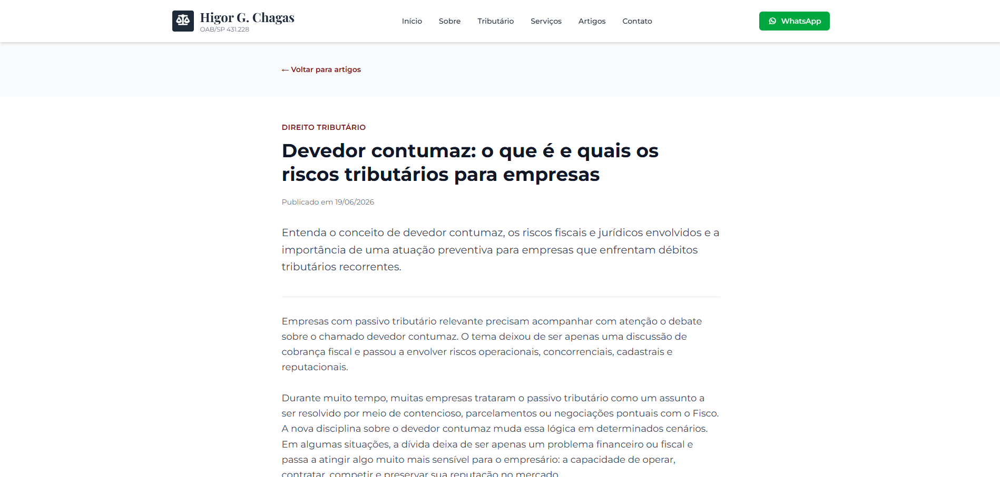
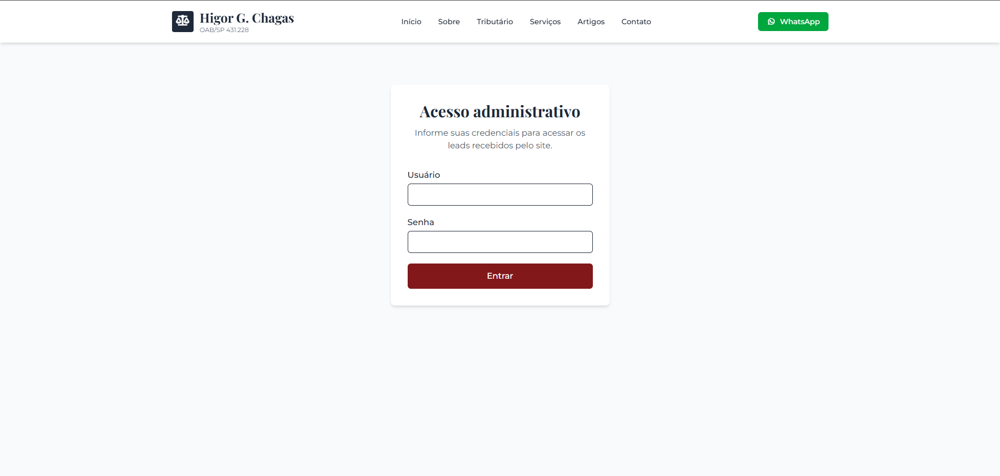
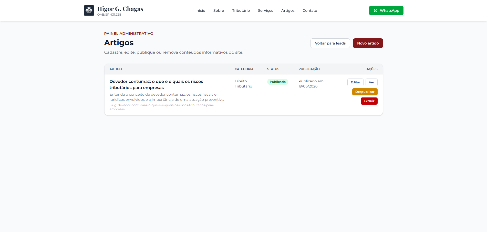
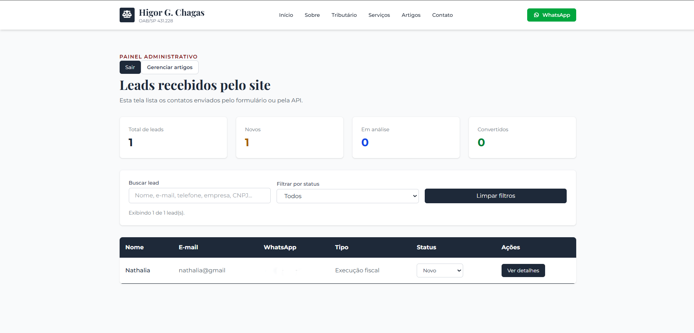

# Higor Chagas Advocacia — Case de Projeto Full Stack

Projeto desenvolvido a partir de uma landing page estática criada inicialmente para o escritório de advocacia do meu marido.

Meses depois, durante minha busca por recolocação profissional, decidi revisitar a ideia e transformar o site em uma aplicação Full Stack real, publicada em produção, com frontend, backend, banco de dados, painel administrativo, artigos dinâmicos, captação de leads e analytics.

> Este repositório é apenas uma apresentação do projeto.  
> O código-fonte completo permanece privado por segurança e proteção do projeto em produção.

## Site publicado

https://www.higorchagasadv.com.br

## Funcionalidades

- Site institucional responsivo
- Página de atuação tributária
- Área pública de artigos
- Página individual para cada artigo
- Formulário de contato
- Cadastro de leads
- Painel administrativo protegido por login
- Gerenciamento de leads
- Gerenciamento de artigos
- Publicação e despublicação de conteúdos
- Integração com analytics
- Deploy em domínio próprio

## Tecnologias utilizadas

### Frontend
- Angular
- TypeScript
- Tailwind CSS
- Vercel

### Backend
- Java
- Spring Boot
- Spring Security
- Spring Data JPA
- API REST
- Render

### Banco de dados
- PostgreSQL
- Neon

### Infraestrutura
- GitHub
- Registro.br
- Variáveis de ambiente
- CORS em produção
- Vercel Analytics

## Destaques Técnicos

✅ Aplicação Full Stack publicada em produção

✅ Painel administrativo protegido por autenticação

✅ Gerenciamento completo de artigos

✅ Captura e gerenciamento de leads

✅ Integração Frontend + API REST

✅ Persistência em PostgreSQL

✅ Deploy independente de frontend, backend e banco de dados

✅ Configuração de domínio próprio

✅ Analytics e monitoramento de acessos

## Screenshots

### Home

### Direito Tributário

### Artigos

### Artigo individual

### Login administrativo

### Painel de artigos

### Painel de leads

## Objetivo do projeto

O objetivo foi evoluir uma página institucional simples para uma aplicação real em produção, aplicando conceitos de desenvolvimento Full Stack, integração entre frontend e backend, persistência em banco de dados, autenticação administrativa, deploy em nuvem e configuração de domínio próprio.

## Observação

Este projeto possui finalidade profissional e de portfólio. O código-fonte completo não está disponível publicamente.

## Tecnologias Utilizadas

### Frontend

### Backend

### Banco de Dados

### Deploy & Infraestrutura

### Ferramentas

